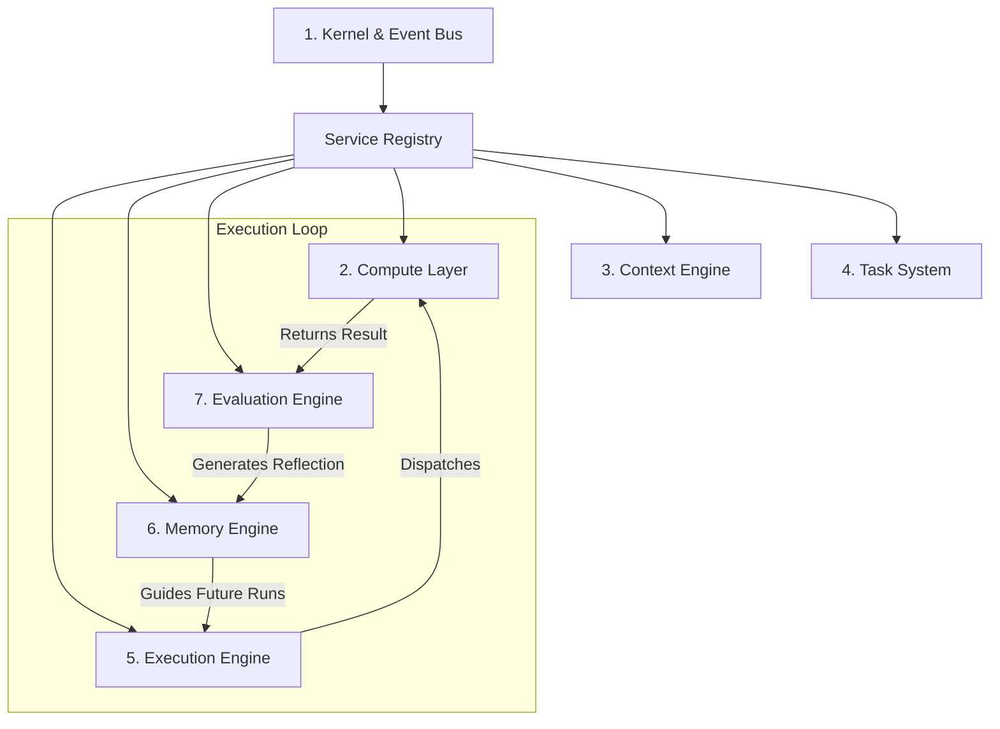

<p align="center">
  
</p>

# SwitchBoard

> **A Local-First, Self-Improving Runtime for AI Task Execution**

SwitchBoard is a developer-centric, local-first orchestration runtime designed to schedule, execute, evaluate, and learn from AI tasks. Rather than orchestrating simple prompts, conversational agents, or raw functions, SwitchBoard treats **Tasks** and dependency-resolved **Workflows** as first-class citizens. 

---

##  The Core Philosophy

AI application developer tools are often tightly coupled to specific LLMs, vector search databases, or rigid agent frameworks. SwitchBoard challenges these assumptions by separating concerns into decoupled platform subsystems:

1. **Platform, Not Agent**: SwitchBoard provides the low-level compute, scheduling, context mapping, memory, and evaluation infrastructure. It does not dictate how agents reason.
2. **Tasks, Not Prompts**: Work is structured as declarative `Tasks` with input context, objectives, resource requirements, and retry limits.
3. **Continuous Learning Loop**: Every completed execution is evaluated, producing actionable recommendations that are saved to a persistent memory store. Future tasks leverage this historical knowledge to optimize execution.
4. **Storage & Hardware Independent**: Out-of-the-box support for local inference (Ollama) and file-based state serialization, fully prepared for future vector search, graph databases, or distributed hardware backends.

---

##  System Architecture

SwitchBoard is composed of seven core subsystems coordinated by a central registry:



### 1. Central Kernel (`switchboard/kernel/`)
Coordinates the application lifecycle. It boots services based on topological dependency graphs, initializes structured logger handlers, and exposes a decoupled asynchronous **Event Bus** for pub/sub telemetry broadcasts.

### 2. Compute Layer (`switchboard/compute/`)
Manages physical inference backends (adapters for live **Ollama** and a Mock fallback). It isolates model generations within short-lived, transaction-like `ComputeSession` contexts.

### 3. Context Engine (`switchboard/context/`)
Analyzes local repositories to build reusable context packages. It scans workspace files, filters directories using gitignore matchers, and parses Python code blocks statically using AST analysis to map symbol reference graphs.

### 4. Task System (`switchboard/task/`)
Defines the canonical model schemas (`Task`, `TaskResult`, `Artifact`, `TaskContext`) and coordinates workflow graphs using Directed Acyclic Graphs (DAGs) to resolve dependencies.

### 5. Execution Engine (`switchboard/execution/`)
Coordinates the execution loop. It tracks queue statuses (`Waiting`, `Ready`, `Running`, `Blocked`), restricts parallel execution using VRAM/RAM hardware locks, schedules tasks via pluggable policies (`PriorityVRAMPolicy`, `FIFOPolicy`, `SequentialPolicy`), and handles failures using exponential backoff retry manager cycles.

### 6. Memory Engine (`switchboard/memory/`)
Provides persistent knowledge retention. It organizes entries into execution, context, reflection, and knowledge categories, filters candidate entries using tag overlap algorithms, and ranks results utilizing recency decay and usage popularity.

### 7. Evaluation Engine (`switchboard/evaluation/`)
Closes the learning loop. It runs deterministic rule-based evaluators (Success, Latency, VRAM resource limits, and expected Artifact builders), computes weighted metric scores, and pushes actionable insights as reflections back to the Memory Engine.

---

##  Directory Layout

```text
switchboard/
├── cli/                 # Command line tools (diagnostics, doctor checks)
├── compute/             # Inference managers, providers, and session contexts
│   └── adapters/        # Hardware adapters (Ollama, Mock inference)
├── context/             # Repository codebase scanning and AST symbol parsing
├── task/                # Declarative task models and Workflow DAG representations
├── execution/           # Resource locks, retry handlers, and scheduling loops
├── memory/              # Memory engine managers, rankings, and persistent stores
├── evaluation/          # Pluggable scoring evaluators and report compilers
├── interfaces/          # Subsystem API protocol contracts
├── types/               # Shared models, enums, and event bus schemas
├── kernel/              # Lifecycle bootstrapper, registry, and Event Bus
├── logging/             # Structlog structured trace configs
└── config/              # Pydantic Settings and TOML settings loaders
```

---

##  Getting Started

### Prerequisites
- Python 3.10+
- [uv](https://github.com/astral-sh/uv) (recommended)
- [Ollama](https://ollama.com/) (running locally)

### Installation
Clone the repository and sync dependencies:
```bash
git clone https://github.com/goblinasaddy/switchboard.git
cd switchboard
uv sync
```

### Verification
Run the integrated CLI environment diagnostics command to verify that all systems boot, connect to Ollama, scan codebase files, and dispatch memory and evaluation loops successfully:
```bash
uv run python -m switchboard.cli.app doctor
```

Output:
```text
Executing SwitchBoard Environment Diagnostic Checks...

  [OK] Python version: 3.13.3 (Compatible)
  [OK] Settings parsed successfully. Env mode: development
  [OK] Conf. limits -> Max VRAM: 12.0 GB, Max RAM: 16.0 GB
  [OK] Compute Layer loaded provider 'mock'. Models: ['mock-llama3', 'mock-mistral']
  [OK] Ollama connection verified at http://localhost:11434. Models: []
  [OK] Context Engine indexed codebase: 121 files, 1369 symbols. Languages: {'unknown': 4, 'markdown': 18, 'python': 99}
  [OK] Task System registered diagnostic task: 7bded4c1-5d46-4174-ab88-012f87f093ed
  [OK] Execution Engine verified. Queues -> Waiting: 0, Ready: 0, Running: 0. Available VRAM: 12.0/12.0 GB
  [OK] Memory Engine verified. Store: JSONFileStore
  [OK] Evaluation Engine verified. Registered Evaluators: ['ExecutionEvaluator', 'ResourceEvaluator', 'ArtifactEvaluator']

All compatibility checks passed! SwitchBoard is ready to run.
```

### Running Tests
Execute the comprehensive test suite:
```bash
uv run pytest
```

---

##  License
This project is licensed under the MIT License - see the [LICENSE](LICENSE) file for details.
